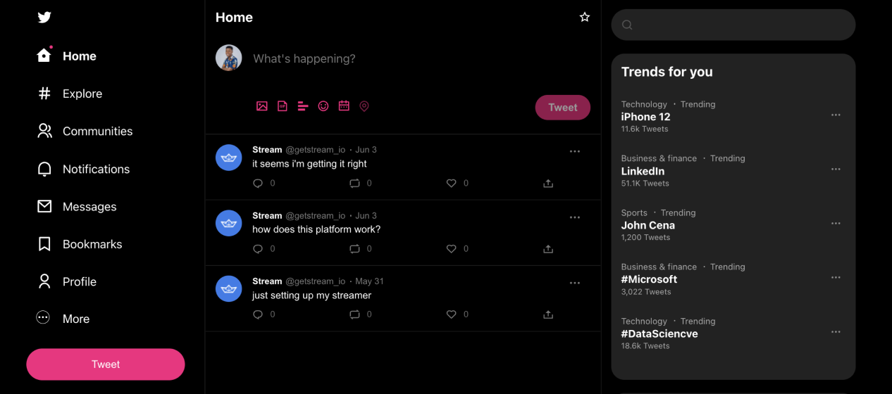

# streamer

streamer is a Twitter Clone built with Stream Feeds and the React Feeds SDK:



## Quick Links

- [Register](https://getstream.io/chat/trial/) to get an API key for your Stream App
- [React Feeds SDK](https://github.com/GetStream/react-activity-feed)
- [React Feeds Tutorial](https://getstream.io/react-activity-feed/tutorial/)

## What is Stream?

Stream allows developers to rapidly deploy scalable feeds and chat messaging with an industry-leading 99.999% uptime SLA guarantee. With Stream’s chat components, developers can quickly add chat to their app for a variety of use-cases:

- Livestreams like Twitch or Youtube
- In-Game chat like Overwatch or Fortnite
- Team style chat like Slack
- Messaging style chat like Whatsapp or Facebook’s messenger
- Commerce chat like Drift or Intercom

## Repo Overview 😎

This repo contains full source code for the [Build a Twitter Clone](https://getstream.io/blog/build-twitter-clone/) tutorial series on Stream's blog.

Supported functionalities in this clone include:

- Sign in using different user accounts
- Create tweets
- React to tweets (like and comments)
- Follow users
- Notifications for reactions and follows

## Requirements 🛠

- [Register](https://getstream.io/chat/trial/) and create a Stream app (you can call it streamer or whatever you want)
- [Install Node v16.13.1](https://nodejs.org/ru/blog/release/v16.13.1/) (16.13.1 is the version used for this project)

## Steps to Run Locally 🧑‍💻👩‍💻

- Clone this repo:

  ```bash
  git clone https://github.com/GetStream/react-twitter-clone
  ```

- Install dependencies:

  ```bash
  npm install
  ## or
  yarn
  ```

- Add the **API key** and **APP ID**  of your Stream app to [src/App.js, line 15 and 16](./src/App.js#L15)

- Using your **API key** and **API Secret**, [generate user tokens](https://generator.getstream.io/) for all users in [users.js](./src/users.js) and replace the token property accordinly

- [Create three feed groups](https://getstream.io/activity-feeds/docs/node/creating_feeds/) on your Stream dashboard for your app:
  - **timeline** feed group of flat type
  - **user** feed group of flat type
  - **notification** feed group of notification type

- Start server:

  ```bash
  npm run start
  ```

Your Twitter clone will be live on `localhost:3000` and you can begin experimenting the functionalities or adding yours 😁

Kindly leave a star on the [React Feeds SDK](https://github.com/GetStream/react-activity-feed) if you enjoyed the result of the tutorial 😁
